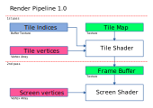
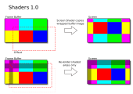

## Tile Renderer

This is a small project, started with the aim of learning a bit more about [C++](https://isocpp.org/) and
[OpenGL](https://www.khronos.org/opengl/).

The idea is to implement a simple tile-based renderer, and perhaps do something more interesting with it later
on. At the moment the project is very minimal, it's an early version for learning purposes more than anything
else,  so there is no support beyond what is currently uploaded.

The current rendering pipeline consists of two stages, with tiles first rendered to a frame buffer and then
onto the screen. The current pipeline does not make use of depth or stencil buffers, however these may be
included later on if required.

Currently the tile shader makes a direct copy of the frame buffer image, which is set to wrap.
The tile shader is set up to only render newly exposed tiles when the background moves.
There's no immediate need to reduce the rendering overhead, this was simply done to experiment with the
shader code.

The general aim is to try and improve in the following areas:
- Write simple, clear, and easily followed code
- Encapsulate OpenGL code with RAII
- Use the GPU as much as possible

Once the background rendering code is cleaned up, the plan is to add animated tiles and sprite rendering.
The plan is to eventually add animated tiles and sprites, and possibly some post-processing/screen space effects.

For anyone interested in learning more about OpenGL and how shading works, 
["Learn OpenGL"](https://learnopengl.com/) does a pretty decent job of explaining the fundamentals.

